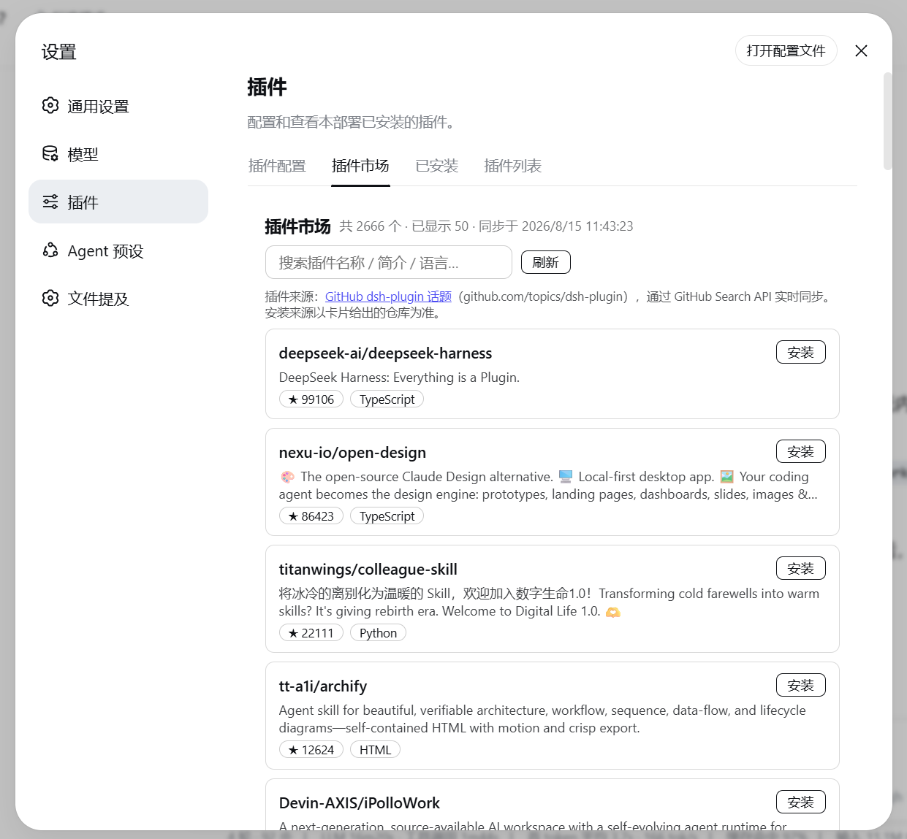
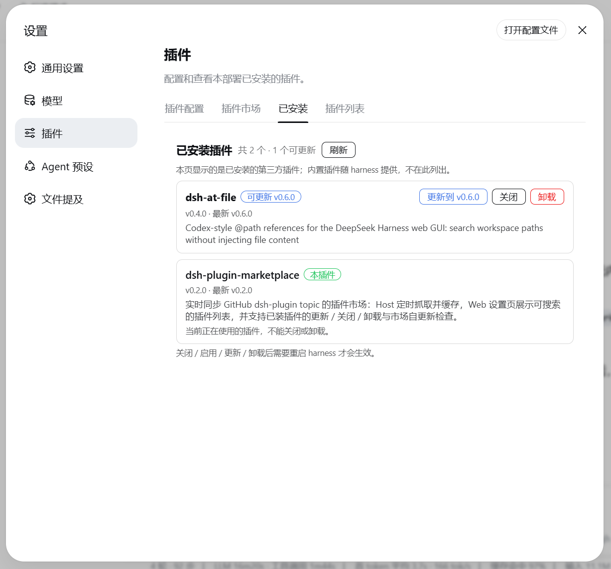

# dsh-plugin-marketplace

English | [中文](README.md)

[](https://github.com/AwesomeHou/dsh-plugin-marketplace)

A **permanent** DeepSeek Harness plugin that turns the GitHub
[`dsh-plugin`](https://github.com/topics/dsh-plugin) topic  into a
**plugin marketplace** — a tab inside **设置 → 插件**, plus a pair of model
tools so the agent itself can search and install plugins.




*The plugin marketplace: search, browse, one-click install, update.*

## Features

- **Paginated feed** — the full topic is served page by page (default 50,
  max 100) from the GitHub Search API, with a "加载更多" (load more) button in
  the UI. No arbitrary 50-repo cap: `total` reflects the real `total_count`.
- **Search** — keyword search runs through GitHub's own `q`, so it searches
  the *whole* topic rather than only loaded pages. Available both in the UI
  search box and via the `market_search` tool.
- **Agent tools** (registered on Host via `ctx.tools.register`):
  - `market_search(q?, page?, perPage?)` — JSON list of topic repos
    (full name, stars, language, description, URL).
  - `market_install(spec)` — install into the `web` profile via
    `dsh plugin --profile web add -w <spec>`. Validates the spec against shell
    metacharacters before running; reports that a harness restart is required.
  - `market_installed()` — list the **third-party** plugins installed in the
    `web` profile: enabled state, installed/latest versions and whether an
    update is available (including this marketplace's own status). Built-ins
    are not listed.
  - `market_update(name)` — update one installed plugin to its latest version
    (restart required to take effect).
- **One-click install** — every marketplace card has an **安装** (Install)
  button that POSTs `/api/market/install` and shows
  installing/installed/failed state.
- **Plugin updates (new-version hint)** — every installed plugin is compared
  against its latest version (npm registry `latest`, or the `version` in the
  default-branch `package.json` for GitHub-hosted plugins). Cards get a
  **可更新** badge and an **更新** (Update) button via `/api/market/update`.
- **Built-in vs user-installed** — packages in `dsh.profile.bundles` that come
  from the profile template are **built-in** (ship with the harness; cannot be
  disabled/uninstalled); packages later added to `dependencies` are
  **user-installed**. The **已安装** tab lists only user-installed
  (third-party) plugins — built-ins are not shown, and the page states this.
- **Disable / uninstall user-installed plugins** — **关闭 / 启用** (via
  `/api/market/set-enabled`) toggles the plugin in/out of `dsh.profile.bundles`
  (the dependency is kept); **卸载** (via `/api/market/uninstall`) runs
  `dsh plugin --profile web remove <name>` and drops it from the bundle layer
  list. Both need a harness restart.
- **Self-update check** — the marketplace checks its own latest version (read
  from its GitHub repo's `package.json`). When a new version exists, a banner
  `vX → vY · 立即更新` appears at the top of both the 插件市场 and 已安装 tabs.
- **Source disclosure** — the **插件市场** tab states its source: the GitHub
  `dsh-plugin` topic (`github.com/topics/dsh-plugin`), synced live through the
  GitHub Search API.
- **Inside the Plugins settings** — registers two `settings.plugins.tab`
  entries (`market` 插件市场, `installed` 已安装) beside the shipped
  "插件配置" (Plugin config) and "插件列表" (Plugin list) tabs.

## Install

### Manual install

```sh
dsh plugin --profile web add https://github.com/AwesomeHou/dsh-plugin-marketplace
```

Requires a harness restart to take effect.

### Let the agent install it

```
Install this plugin for me: https://github.com/AwesomeHou/dsh-plugin-marketplace
```

## How it is wired

| Piece | File | Role |
|---|---|---|
| Bundle manifest | `package.json` | `dsh.bundle.patch` (host layer) + `dsh.client` (browser module) |
| Patch layer | `cordis.patch.yml` | Inserts the plugin's own host row into the Loader tree |
| Host half | `lib/index.js` | Hand-maintained bundle (no `src` source): GitHub paginated sync + `/api/market/list`, `/api/market/installed`, `/api/market/update`, `/api/market/set-enabled`, `/api/market/uninstall` + `market_search`/`market_install`/`market_installed`/`market_update` tools |
| Client source | `src/client/index.js` + `src/client/locales.js` | Browser-half source: the two settings tabs + search + one-click install + update / disable / enable / uninstall + self-update banner; UI strings go through the `ctx.locale` dictionary (`locales.js` carries `zh`/`en` — no hardcoded text) |
| Client bundle | `lib/client.js` | **Generated by tsdown from `src/client/`** (`__ModuleLoader__` bundle), git-ignored; `prepare` builds it on git install |

Data flows over the same-origin HTTP endpoints (`/api/market/*`) the Host
half registers on `ctx.webServer` — permanent bundles have no
`harness`/`host.call` sandbox RPC, so the browser half uses `fetch`.

## Development

```sh
npm install             # install devDependencies (tsdown)
npm run build           # tsdown generates lib/client.js from src/client/
npm run check           # syntax-check both halves (lib/index.js, lib/client.js)
```

- `lib/client.js` and its sourcemap are build output (git-ignored, not
  committed); `prepare` runs `build` automatically on git installs.
- `lib/index.js` (Host half) is a hand-maintained bundle with no source tree
  and is always committed.
- UI copy lives in `src/client/locales.js` (a `zh`/`en` dictionary); after
  editing it, run `npm run build` to regenerate the bundle.

## License

MIT
